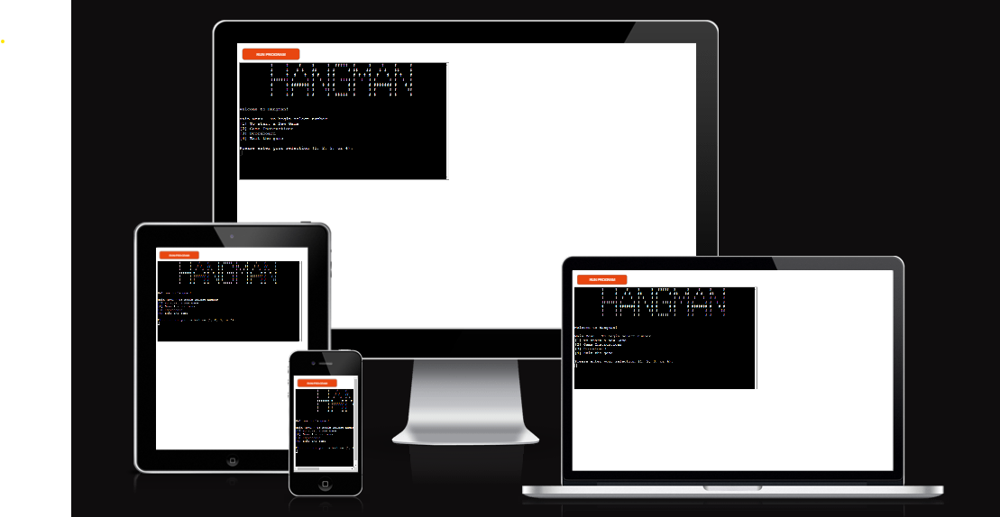
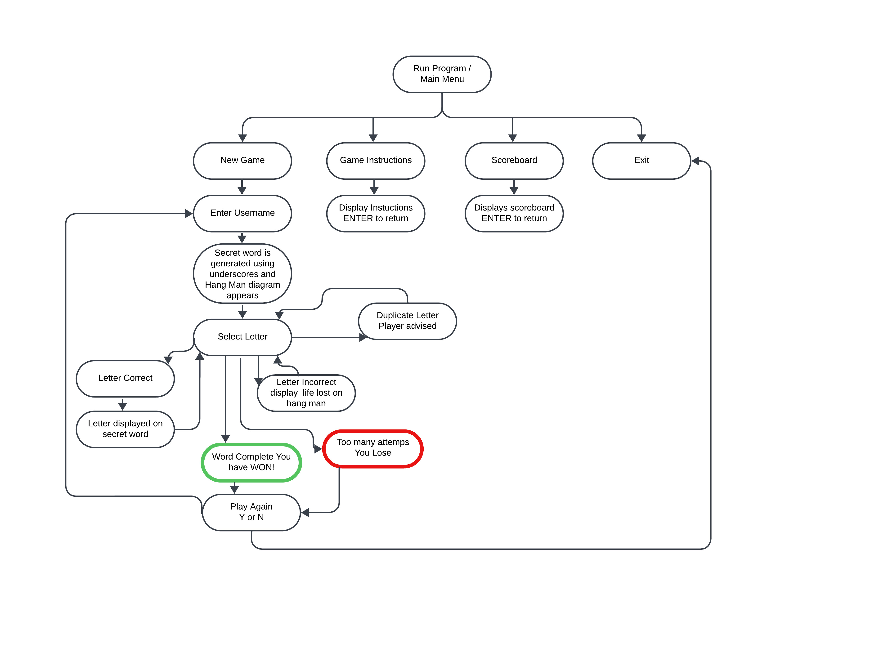

# [Hang Man](https://hang-man2023-457c30e677c0.herokuapp.com/)

(Developer: Natalie Lockyer)
## Demo
[To view live website, click here](https://hang-man2023-457c30e677c0.herokuapp.com/)

Hang Man is a word guessing game, based on the original 'Hangman'. The game has been designed to give users a limited number of lives to guess the secret word. The secret word is displayed as underscores ( _ _ _ ) .When a player guesses the letter correctly, the letter appears in the word which is displayed under the diagram. If they guess the letter in correctly, a life will be lost and a part of the stick man will dispaly on the diagram. Once the game has finished users will be given the oppurtunity to play again.

# Contents
+ [User Experience](#user-experience)
    + [Key Project Goals](#key-project-goals)
    + [Target Audience](#target-audience)
    + [User Requirements and Expectations](#user-requirements-and-expectations)
    + [User Stories](#user-stories)
    + [Lucid Chart](#lucid-chart)
    + [Design ]
        + [Typography ]
+ [Features ]
  + [Current Features]
    + [TBC ]
    + [Game Information]
    + [Future Features]
+ [Technologies Used]
  + [Languages Used]
  + [Frameworks Used]
+ [Testing ]
  + [Validator Testing]
  + [Lighthouse Testing]
  + [Problems Encountered]
  + [Responsiveness ]
  + [Full Testing ]
 + [Deployment and Local Deployment]
  + [Deployment ]
  + [Local Deployment]
  + [How to Clone]
+ [Credits ]
  + [Code ]
  + [Media ]
  + [Acknowledgements ]

***
***

# User Experience

### Key Project Goals
* To write and develop an enjoyable interactive game in a terminal in Python.
* The functionality of the game should keep to the core concepts of Hangman.
* The user should be able to navigate around this easily. 
* On the loading screen, the user is able to choose options to either, start the game, read the game instructions, view the scoreboard, or exit the game. 
* Add username and amount of guesses taken to google sheets so the score board is updated.
* At the end of the game the user is able to choose if they wish to play again, or exit the game.

### Target Audience
  * Users of any age that would like to play an enjoyable and interactive word game. 
  * Users who wish to improve thier spelling skills, increase vocabulary and keep the mind focused.  
  * Users who like terminal based games.

### User Requirements and Expectations 
  * An accessible game that is clear and easy to understand.
  * The ability to personalise the game by adding your name.
  * A fun and interactive game that is appealing and well structured and has clear navigation options.
  * Users are able to find instructions on how to play if they are not familiar with the game, and given the time they need to read this.
  * To be able to view the scoreboard, which is linked to google sheets to see the list of how many guesses it has taken them and other users.
  * Users to recieve feedback throughout the game, whether this is that they have dulplicated a letter, the user has won or the user has lost the game. 
  * Users are able to select Y or N if they wish to play again. If no the player will be taken back to the main menu. 
    
### User Stories
As a site visitor,

  * I want to play interactive game.
  * Initially a red button with run program and a large black screen underneath appear.
  * When the run program button is selected I can see the title 'Hang Man' in text that looks like it it lots of stick men which is in line with the theme of the game. 
  * I am given 4 choices of what I would like to do, 
    + 1 - Start Game
    + 2 - Game Instructions
    + 3 - Scoreboard
    + 4 - Exit Game
  * I start with 1, When I enter 1, I am asked for my name, Once I enter this I am taken to a new screen where I can see the hang man stand and a number of underscores relating to the secret word. 
  * I guess a letter and its correct. The letter replaces the underscore in the word and I can guess another letter.
  * I duplicate this letter and recieve a message explaining that I have already used this letter.
  * I guess another letter incorrectly and a life is lost. This appears on the hang man diagram.
  * Once I have used up all my lives, I recieve a message telling me as such. I am then asked if I want to play again (Y or N), I click Y, this asks me for my name again and the game will restart on a new screen.
  * Once I guess all the letters correctly, I receive a messageg telling me as such. I am then asked if I wish to play again this time I select N and I return to the main menu. 
  * I would like to see how many guesses it took to win on the previous game. I press 3 on the main page and this takes me onto a new page called Score Board. I can see how many guesses this last game took me and I can see other users game information too. I then press ENTER to return to the main menu.
  * I then select option 2, this takes me to a new screen and shows me the 'rules' of the game. Once I have read them I click ENTER and I am taken back to the main page.
  * I then select option 4, this exits me out of the game.

### Lucid Chart
I have created this flow chart diagram on Lucid Charts. This was used to help with writing the game functionality. 

