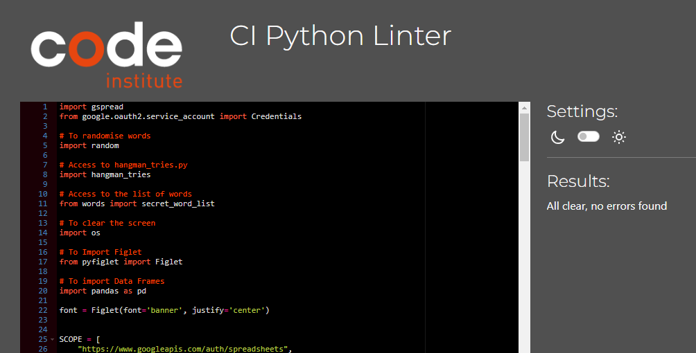
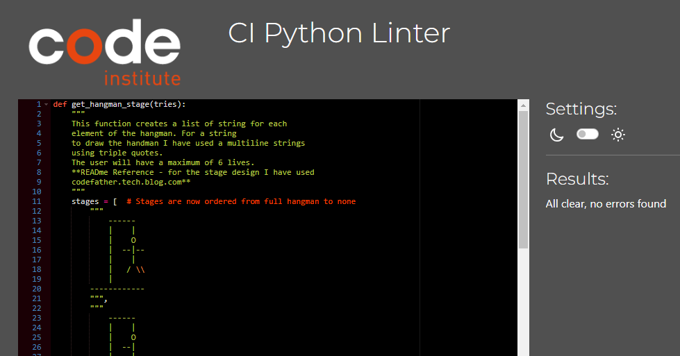
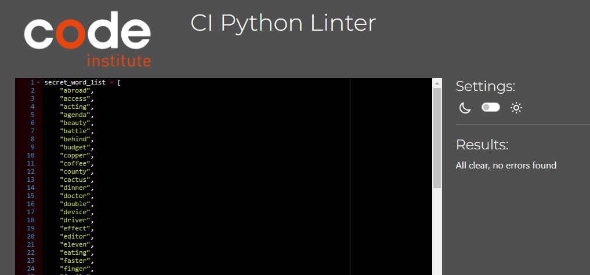

# [Hangman Game](https://hang-man2023-457c30e677c0.herokuapp.com/)
(Developer: Natalie Lockyer)

Hangman is a word guessing game, based on the original 'Hangman'. The game has been designed to give users a limited number of lives to guess the secret word. The secret word is displayed as underscores ( _ _ _ ) .When a player guesses the letter correctly, the letter appears in the word which is displayed under the diagram. If they guess the letter incorrectly, a life will be lost and a part of the stick man will dispaly on the diagram. Once the game has finished users will be given the oppurtunity to play again.

## Demo
[To view live website, click here](https://hang-man2023-457c30e677c0.herokuapp.com/)

# Contents
+ [User Experience](#user-experience)
    + [Key Project Goals](#key-project-goals)
    + [Target Audience](#target-audience)
    + [User Requirements and Expectations](#user-requirements-and-expectations)
    + [User Stories](#user-stories)
    + [Lucid Chart](#lucid-chart)
+ [Design](#design)
    + [Typography ](#typography)
+ [Features](#features)
     + [Main Start Page](#main-start-page)
     + [Game Instructions Page](#game-instructions-page)
     + [Scoreboard Page](#scoreboard-page)
     + [Exit Page](#exit-page)
     + [Start New Game Page](#start-new-game-page)
     + [Lose Screen Page](#lose-screen-page)
     + [Win Screen Page](#win-screen-page)
     + [Goodbye Page](#goodbye-page)
     + [Future Features](#future-features)
  + [Technologies Used](#technologies-used)
    + [Languages Used](#language)
    + [Frameworks Used](#frameworks-and-tools)
    + [Python Libraries](#python-libraries)
    + [My Python Files ](#my-python-files)
+ [Testing](#testing)
  + [Code Validation](#code-validation)
  + [Full Testing](#full-testing)
  + [Bugs](#bugs)
  + [Supported Browsers](#supported-browsers)
 + [Deployment and Local Deployment](#deployment-and-local-deployment)
  + [Deployment](#deployment)
  + [Local Deployment](#local-deployment)
  + [How to Clone](#how-to-clone)
+ [Credits](#credits)
+ [Acknowledgement](#acknowledgements)

***
***

# User Experience

### Key Project Goals
* To write and develop an enjoyable interactive game in a terminal in Python.
* The functionality of the game should keep to the core concepts of Hangman.
* The user should be able to navigate around this easily. 
* On the loading screen, the user is able to choose options to either, start the game, read the game instructions, view the scoreboard, or exit the game. 
* Add the username and amount of guesses taken, to google sheets so the score board is updated.
* At the end of the game the user is able to choose if they wish to play again, or exit the game.

### Target Audience
  * Users of any age that would like to play an enjoyable and interactive word game. 
  * Users who wish to improve thier spelling skills, increase vocabulary and keep the mind focused.  
  * Users who like terminal based games.

### User Requirements and Expectations 
  * An accessible game that is clear and easy to understand.
  * The ability to personalise the game by adding your name.
  * A fun and interactive game that is appealing and well structured and has clear navigation options.
  * Users are able to find instructions on how to play if they are not familiar with the game, and given the time they need to read this.
  * To be able to view the scoreboard, which is linked to google sheets to see a list of how many guesses it has taken them and other users.
  * Users to recieve feedback throughout the game, whether this is that they have dulplicated a letter, the user has won or the user has lost the game. 
  * Users are able to select Y or N if they wish to play again. If no the player will be taken back to the main menu. 
    
### User Stories
As a site visitor,

  * I want to play an interactive game.
  * Initially a red button with 'run program' and a large black screen underneath appear.
  * When the 'run program' button is selected I can see the title 'Hangman'.
  * I am given 4 choices of what I would like to do, 
    + 1 - Start Game
    + 2 - Game Instructions
    + 3 - Scoreboard
    + 4 - Exit Game
  * I start with 1, When I enter 1, I am asked for my name. If I dont enter any character in the username, I get an invalid entry message. I then enter my name and I am taken to a new screen where I can see the hangman stand and a number of underscores relating to the secret word.
  * I guess a letter and it is correct. The letter replaces the underscore in the word and I can guess another letter.
  * I duplicate this letter and recieve a message explaining that I have already used this letter.
  * I guess another letter incorrectly and a life is lost. This appears on the hang man diagram.
  * Once I have used up all my lives, I recieve a message telling me I have used my lives and the game is over. I am then asked if I want to play again (Y or N), I click Y, the game restarts on a new screen.
  * Once I guess all the letters correctly, I receive a message telling me I have won. I am then asked if I would like to play again. This time I select N and I return to the main menu. 
  * I would like to see how many guesses it took to win on the previous game. I press 3 on the main page and this takes me onto a new page called Score Board. I can see how many guesses this last game took me and I can see other users game information too. I then press ENTER to return to the main menu.
  * I then select option 2, this takes me to a new screen and shows me the 'rules' of the game. Once I have read them I click ENTER and I am taken back to the main page.
  * I then select option 4, this exits me out of the game.

### Lucid Chart
I have created this flow chart diagram on Lucid Charts. This was used to help with writing the game functionality. 

## Design

## Typography

For the main titles on the page, I used Figlet. I initally chose a font called 'acrobatic' which was letters made up from small stick figures. When I ran this in the terminal, the font was far too big. I wasn't able to reduce the size of the font. 
I then opted for a font called 'Banner', the titles now sit nicely on the page. I have also centered them using justify-centre.
This image was extracted from the [Figlet webpage](www.figlet.org/examples)

## Features

### Main Start Page

This is the main screen page. Here you can see the title of the game and a welcome message. There is also a main menu where the user can choose 1 of 4 options. 
1 to start a New Game, 2 for the Game Instructions, 3 for the scoreboard and 4 to exit the game. 
The user is able to chose which option by selecting one of these numbers from thier keypad.

### Game Instructions Page

When the user selects option 2, they will see a new screen with the game instuctions. Once the user has finished with this they can hit enter to return to the main screen. 

### Scoreboard Page

When the user selects option 3, they will see a new screen with the scoreboard. This is updated when a player completes a winning game. The user can also see the scores of other players and the scores are in ascending order.

Updated Page - The scoreboard is updated with any winning games.

### Exit Page

If the user does not wish to play the game at all, they can simply select option 4 which will exit the game, there is a confirmation message saying "Goodbye".

### Start New Game Page

To start a new game, the user selects option 1. The user is then asked to enter their name. The name that they enter here will be used in the welcome message. 

If the user does not enter anything, they will see a message "You havent entered anything...Please enter your name!"

Once the user, confirms their name by pressing the enter key, the game will begin on a new screen. The page displays a welcome message with the users name, it explains that a new secret word has been chosen and to begin you must select a letter. The empty hangman stand is also on the screen.

The user enters a letter, if this is not an alphabetic letter, a message will appear telling the user that thats an invalid entry and to select a single alpabetic character. If the user selects multiple letters the user will be shown the same message. 

If the user enters a letter that is not in the word, a message appears telling the user that the letter they entered is not in the word, and a life will be lost. This is displayed as a head on the hangman stand. For each incorrect letter guessed, the hangman will continue to add body parts, in total there are 6 parts (head, body, 2 legs and 2 arms.) The user then selects another letter. 

If the user guesses a correct letter, a message will appear telling the user that the letter they entered is in the word and replaces the underscore in the place the letter sits. The user then selects another letter.

### Lose Screen Page

Once the user has exhausted all their tries they lose the game. The player will see a message explaining that they have lost and will reveal what the secret word was. The user is asked if they would like to play again?

If the user selects Y to play again, a new screen will appear and a new game will begin. 

### Win Screen Page

If the user guesses all the letters before the hangman is hung, the game is complete and the user wins. A message is displayed explaining that they have won and would they like to play again?

### Goodbye Page

If the user chooses not to play again this time, they select N and the game will exit with the message "Thank you for playing, I hope you enjoyed it!"

### Future Features
In the future I would like to add the following features:

* I would like to add a frame and colours to make the game look more appealing
* I would like users to be able to create an account so that each time they play on the game they can input their login details.
* To add a defensive question when a player selects Y to exit, "Are you sure you want to exit Y or N?"

## Technologies Used

### Languages Used
* Python

### Frameworks and Tools Used

* [GitHub](https://github.com/)
* [Gitpod](https://www.gitpod.io/)
* [Heroku](https://www.heroku.com/)
* [Lucid Chart](https://www.google.com/aclk?sa=l&ai=DChcSEwi_ssP0o8aCAxXZ2u0KHdQVDoIYABAAGgJkZw&ase=2&gclid=CjwKCAiA9dGqBhAqEiwAmRpTC9XQpJ9OWzIc524kVooNZVo5X8skE08NPqZvjIx4EuTylHyAzyvJSRoCpIIQAvD_BwE&sig=AOD64_1_4moP4TC2Y08_lDNJTfJdGFTwmA&q&nis=4&adurl&ved=2ahUKEwjz3bv0o8aCAxXgXEEAHbzQD5wQ0Qx6BAgOEAE)
* [Prettier Code Formatter](https://prettier.io/)
* [CI Linter Code Checker](https://pep8ci.herokuapp.com/)

### Python Libraries
* [random](https://docs.python.org/3/library/random.html) was imported to randomise the words
* [os](https://docs.python.org/3/library/os.html) was imported to keep the terminal looking clear
* [panda](https://www.w3schools.com/python/pandas/default.asp) was imported to utilise data frames
* [Figlet](https://pypi.org/project/pyfiglet/) was imported to amend the font style

Third party python modules that were imported and used are:
* gspread was imported and this library of code was used to access and update the data in the spreadsheet.
* google.oauth2.service_account was used to authorise the connection with Google Sheets API. 

### My Python Files
* 'hangman_tries' is a file where the structure of the hangman and the lives lost diagrams are stored. This has been imported to the run.py sheet.
* 'words' is a file where the secret words are stored. This has been imported to the run.py sheet. 

## Testing

### Code Validation 

PEP 8 is a style guide for python.

The result of my page was clear, no errors found when page run through the CI Python Linter.

The result of my page was clear, no errors found when page run through the CI Python Linter.

The result of my page was clear, no errors found when page run through the CI Python Linter.

### Full Testing

| Feature      | Expected Outcome | Testing Performed    | Result | Pass or Fail |
|   :---       |      :----:      |        :----:        | :----: |    :----:    |
|      |                  |                      |        |              |
|Select webpage link      | Page Loads       |Select 'RUN PROGRAM'  | Page Loads |   PASS      |
|Select Option 1|New game starts   and user asked   to enter name | Press Key 1 | Game starts   asks for user   to enter name | PASS|
|Select Option 2|New screen with   game instructions| Press Key 2 | New screen loads   game instructions appear  |PASS      |
|Whilst in game instructions   press ENTER to return   to main page |  Return to main page  | Press ENTER    | Return to main page | PASS             |
|Select Option 3|New screen with   scoreboard| Press Key 3 | New screen loads   scoreboard appears    |  PASS            |
|Whilst in scoreboard   press ENTER to return   to main page |  Return to main page  | Press ENTER     | Return to main page | PASS             |
|Select Option 4|Game will exit   displaying message 'Goodbye' | Press Key 4 | Exit game with 'Goodbye' message  | PASS              |
|    |                  |                      |        |              |
|In new Game   Select correct letter   in word | Letter is in the word   places letter in word and   removes underscore| Enter a letter     | Letter appears and in place   | PASS              |
|In Game   Select incorrect letter   in word | Message advising that   letter isnt in the word   select another letter| Enter a letter     | Mesage apears Select another letter  | PASS              |
|In Game   Select incorrect letter   life lost | Hangman stage added | Enter incorrect a letter     | Hangman stage added  | PASS             |
|In Game   Select anything other   than a letter | Message advising of   invalid selection   try again| Enter a ?   | Message appears   | PASS              |
|Play again option| User can choose Y or N to play again   Y = Start new game   N - Exit Game    | Pressed Y   Pressed N   |Y - New Game started   N = Game ends |PASS |
|      |                  |                      |        |              |

### Bugs

* Initially I couldnt get the Hangman to display in the correct order. After playing about and trying numerous ways around it, I discovered that if i displayed the images back to front they came out in the correct order. 

* When running the game in the terminal, I was expecting the scoreboard to be updated with the username, however it was inputting the secret word. There was an error in my code and a quick edit sorted this issue.   

* Heroku Bug - when deploying my page to Heroku, I was met with a large error message. Having spoken with a tutor for some guidance, we discovered that a number of the main json file names were incorrect, this was changed and the error message went. 

There are no bugs remaining.

### Supported Browsers

* Chrome
* Firefox
* Safari
* Edge

## Deployment and Local Deployment

### Deployment 

All code was written within GitPod development environment. I used GitHub for version control and was finally deployed to Heroku from GitHub.

To deploy this site on Heroku the following steps were performed:

After the initial account setup
* Click the "create new app" button on heroku
* Create a unique name for the app
* Select region (Europe was selected for this project)
* Click "create app"
* Go to settings tab
* Set config vars using the creds1.json file. In the field for key, "CREDS1" should be entered and in the field for value, the entire creds1.json file content is entered
* Then click "add buildpack"
* Use python and nodejs buildpacks
* The buildpack order should be python on top and nodejs underneath
* Go to the deploy tab
* Select the deployment method (github was used for this project)
* Search for the github repository name ( In this instance I selected Hangman)
* Then click on Connect
* There is an option to use manual deployment or automatic deployment. Make sure main branch is selected
* After the first deployment you will see a message saying "your app was successfully deployed" and there will be a "view" button to take you to your deployed application

### Local Deployment
  How to Fork 
  * Login to Github
  * Open repository
  * Click fork button in the top right corner.

### How to clone 
  * Login to Github
  * Open repository 
  * Click on the 'code' button, select which you would like with HTTPS, SSH or GitHib CLI and copy
  * Open terminal in code editor and change the current directory to the location you want to use is
  * Type 'git clone' and paste link that you copied in step 3, press enter

## Credits

* [Love Sandwiches CI Walk through Project](https://learn.codeinstitute.net/ci_program/diplomainfullstacksoftwarecommoncurriculum) - Code was adatpted from the CI love sandwiches project. 
* [You-Tube Tutorial](https://www.youtube.com/watch?v=m4nEnsavl6w) - I watched this tutorial and adapted some of the code for my own project. 
* [W3Schools](https://www.w3schools.com/) - was used as a refresher to explain loops/while loops when I was unsure why my code wasnt working.
* [Figlet](www.figlet.org/examples) - was used to change the font of my titles.
* [Python](#https://www.python.org/about/help/) was used as a general source of knowledge
Slack - Was use to troubleshoot ideas with my CI colleagues

## Acknowledgements
 * I would like to thank my mentor Spencer Barriball for his help, guidance and feedback throughout this project.
 * I would like to thank my colleagues on Slack who provided help, support and essential feedback.
 * Finally I would like to thank my husband and daughter for always pushing me, supporting me and allowing me the time to code.